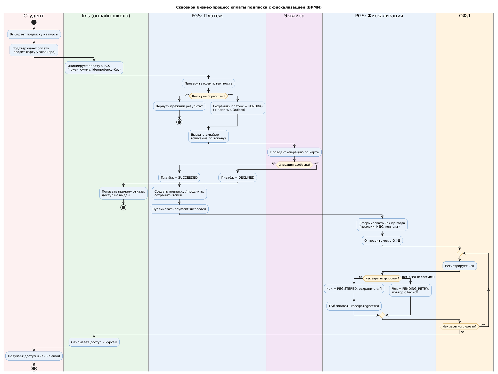
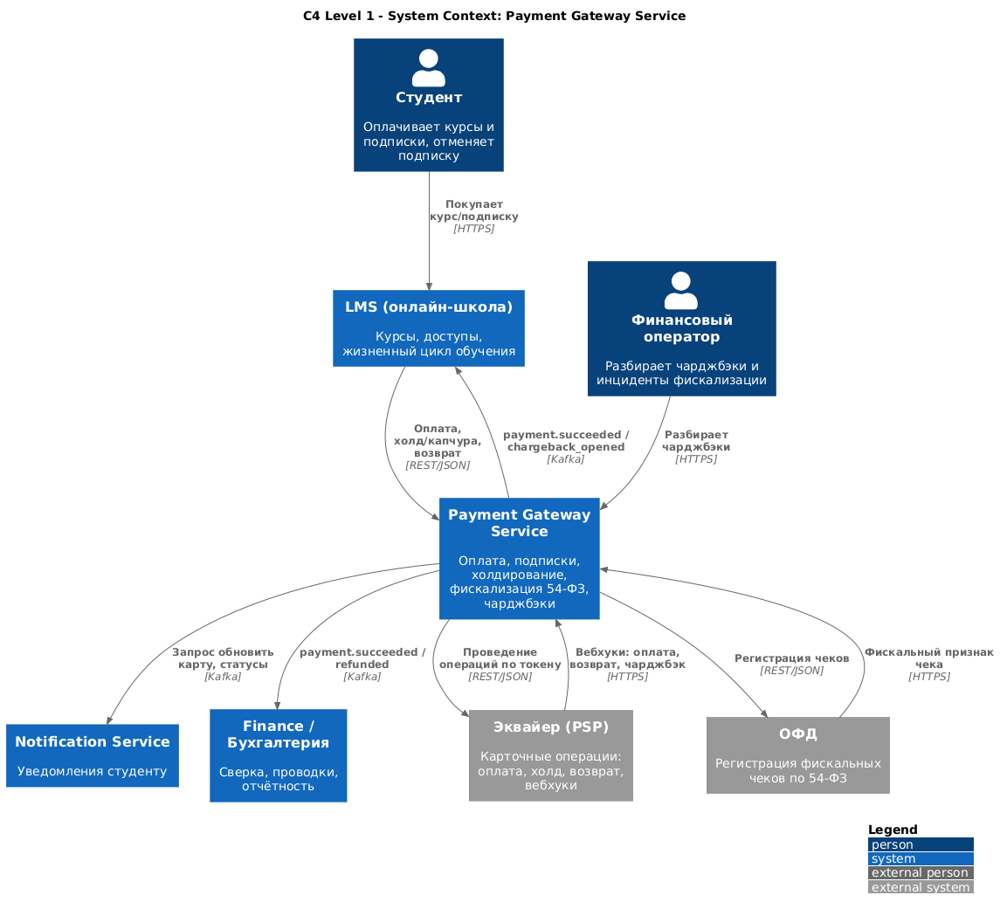
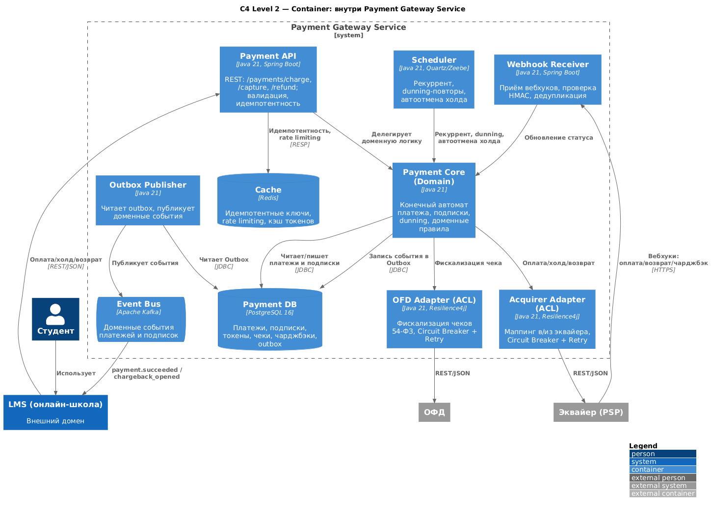
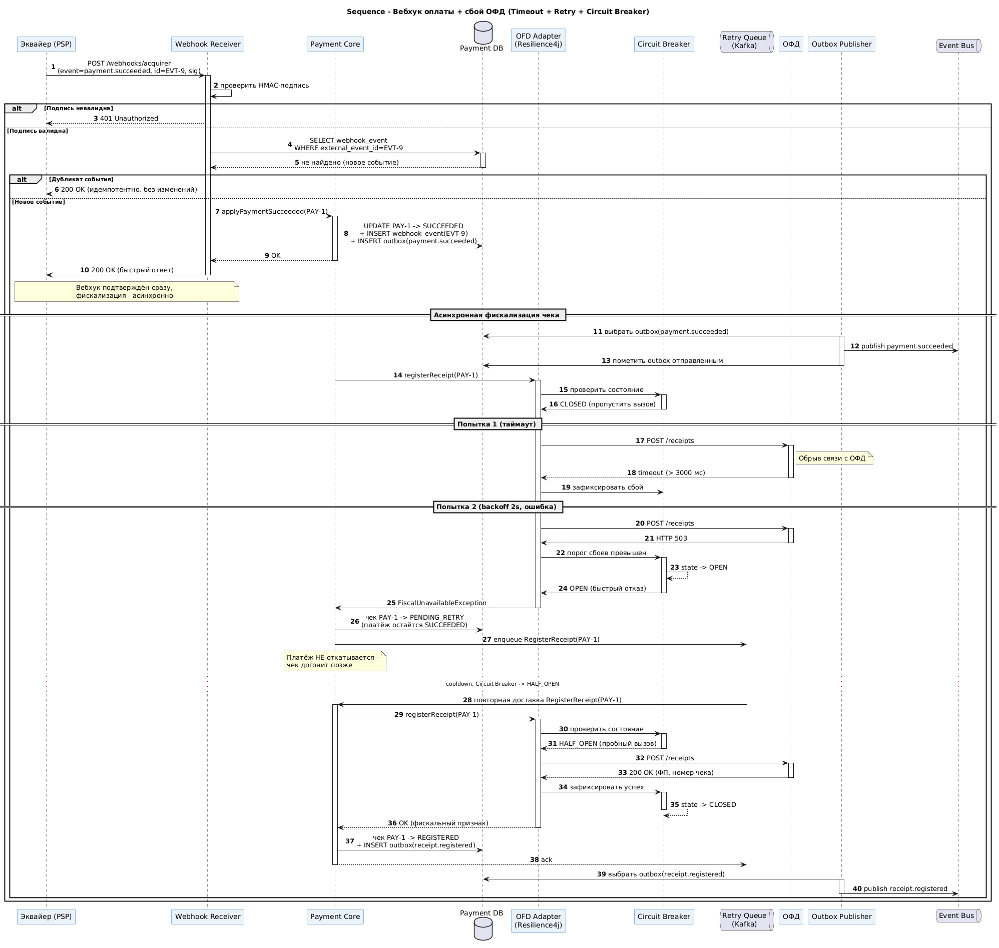
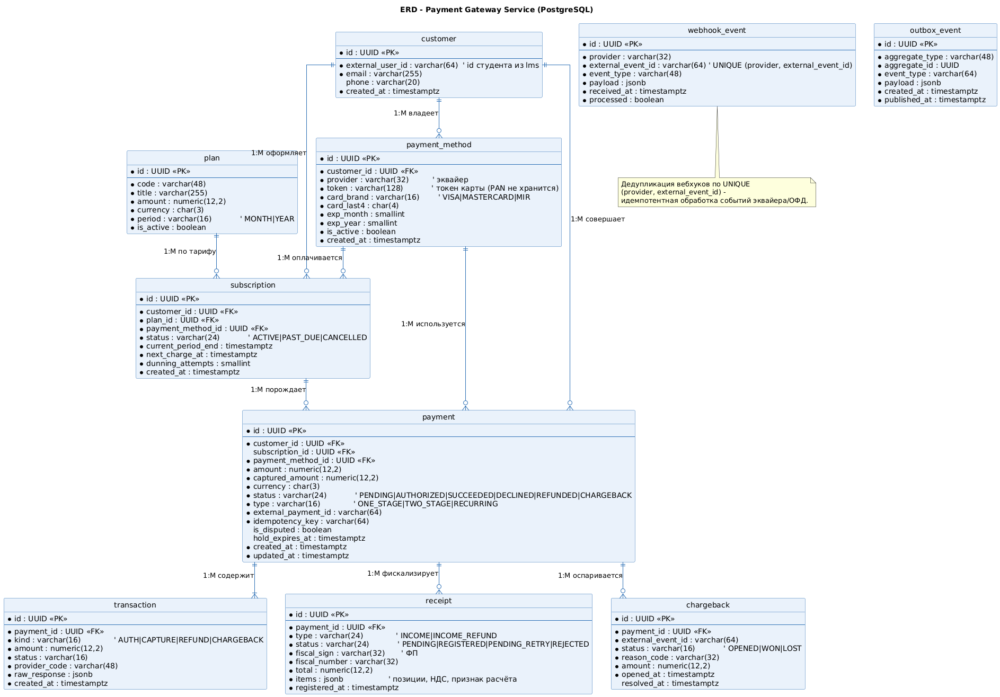
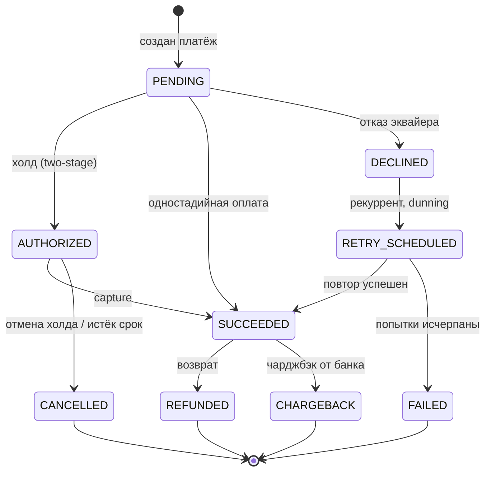

# Payment Gateway Service (PGS)

> Системный анализ и проектирование микросервиса интеграции платёжного шлюза
> для онлайн-школы. Репозиторий ведётся в концепции **Docs as Code**: вся
> документация, требования и диаграммы хранятся в Git, ревьюятся через Pull
> Request и автоматически рендерятся в CI.


---

## 1. Бизнес-контекст

Онлайн-школа `EduX` продаёт доступ к курсам по двум моделям: разовая покупка
курса и **подписка** (ежемесячный/годовой доступ к библиотеке). Деньги
принимаются картами через внешний **эквайер** (PSP), а фискальные чеки
формируются через **ОФД** (оператор фискальных данных) в соответствии с 54-ФЗ.

До внедрения PGS платёжная логика жила внутри монолита `lms` (learning
management system): эквайер был один и захардкожен, рекуррентные списания
запускались cron-скриптом без умных повторов, чеки отправлялись вручную из
бэк-офиса, а чарджбэки разбирались по письмам из банка. Это давало четыре
системные боли:

- **Потерянная выручка на продлениях**: до 18 % рекуррентных платежей
  отклонялись банком (нет средств, лимит, протухшая карта), и без умных
  повторов (dunning) подписка просто отваливалась.
- **Риск по 54-ФЗ**: чеки формировались с задержкой и иногда терялись —
  нарушение закона и претензии клиентов.
- **Двойные списания и рассинхрон**: при обрыве связи с эквайером статус
  платежа оставался «в процессе», оператор списывал повторно вручную.
- **Непрозрачные чарджбэки**: возвратные платежи (chargeback) не связывались
  автоматически с подпиской — доступ к курсу не закрывался.

**Payment Gateway Service** выносит всю платёжную логику в отдельный
микросервис: единый контракт оплаты, двухстадийные платежи (холдирование +
списание), рекуррентные подписки с умными повторами, фискализация по 54-ФЗ
через ОФД и автоматическая обработка чарджбэков. Карточные данные в PGS **не
хранятся** — используется токенизация на стороне эквайера (PCI DSS SAQ-A).

### Цели проекта и метрики

| Цель | Метрика (KPI) | Базовое значение | Целевое значение |
|------|---------------|------------------|------------------|
| Поднять успешность продлений | Recurring success rate | 82 % | **≥ 93 %** |
| Сократить отвал подписок | Involuntary churn (из-за платежа) | 6,1 % | **≤ 2,5 %** |
| Гарантировать чеки 54-ФЗ | Доля платежей с фискальным чеком ≤ 5 мин | 88 % | **≥ 99,9 %** |
| Исключить двойные списания | Доля дублей при сбоях связи | ~ 0,7 % | **0 %** (идемпотентность) |
| Ускорить оплату | p95 latency `POST /payments/charge` | 2 400 мс | **≤ 900 мс** |
| Управлять чарджбэками | Доля чарджбэков, обработанных автоматически | 0 % | **≥ 95 %** |

### Границы системы (Scope)

**In Scope**

- Разовая оплата курса картой (одностадийная и двухстадийная — hold/capture).
- Рекуррентные платежи и жизненный цикл подписки (создание, продление, отмена).
- Умные повторы неуспешных списаний (dunning / smart retry).
- Холдирование средств (authorization) и списание (capture), автоотмена холда.
- Фискализация чеков по 54-ФЗ через ОФД (приход, возврат прихода).
- Обработка чарджбэков и связывание их с подпиской/доступом.
- Возвраты (refund), полные и частичные.
- Публикация доменных событий (`payment.succeeded`, `subscription.renewed`, …).

**Out of Scope**

- Хранение и обработка PAN/CVV (полностью на стороне эквайера, токенизация).
- Выдача доступа к курсам (домен `lms` — PGS лишь публикует события).
- Бухгалтерия, сверка с банком, выгрузка проводок (домен `finance`).
- Антифрод-скоринг (внешний антифрод-провайдер, PGS только вызывает).
- Маркетинговые промокоды и расчёт скидок (домен `pricing`).
- Email/push уведомления (домен `notification-service`).

---

## 2. Архитектурный подход

PGS — **stateless микросервис** в составе платформы онлайн-школы, построенный
по принципам **Domain-Driven Design** и **Event-Driven Architecture**.

- **Стиль интеграции**: синхронный **REST API** (оплата, холд/капчура, возврат —
  для фронта и `lms`) + асинхронный **обмен событиями** через **Apache Kafka**
  (статусы платежей, продления, чарджбэки).
- **Внешние провайдеры** скрыты за паттерном **Anti-Corruption Layer**: отдельные
  адаптеры для эквайера (`acquirer-adapter`) и ОФД (`ofd-adapter`), реализующие
  единые внутренние интерфейсы `AcquirerGateway` / `FiscalGateway`. Это позволяет
  менять PSP/ОФД без изменения доменного ядра.
- **Отказоустойчивость**: все внешние вызовы обёрнуты в **Circuit Breaker + Retry
  с экспоненциальным backoff и идемпотентными ключами**. Рекуррентные повторы
  реализованы как **dunning**-стратегия (отложенные попытки по расписанию).
- **Идемпотентность**: каждый платёж принимает `Idempotency-Key`; повтор того же
  ключа не приводит к двойному списанию. Вебхуки эквайера дедуплицируются по
  `(provider, external_event_id)`.
- **Надёжность событий**: паттерн **Transactional Outbox** — доменное событие
  пишется в БД в одной транзакции с изменением состояния платежа, отдельный
  publisher публикует его в Kafka (at-least-once + идемпотентные консьюмеры).
- **Безопасность**: карточные данные не проходят через PGS (PCI DSS SAQ-A,
  токенизация). Подписи вебхуков проверяются (HMAC), внутри кластера mTLS.

### Стек технологий

| Слой | Технология | Обоснование |
|------|------------|-------------|
| Язык / рантайм | Java 21, Spring Boot 3.x | Стандарт доменных сервисов платформы |
| Синхронный API | REST (OpenAPI 3.0), JSON | Контракт-фёрст, кодогенерация клиентов |
| Асинхронный обмен | Apache Kafka | Партиционирование по `subscription_id`, ordering |
| Хранилище | PostgreSQL 16 | Транзакции, JSONB для сырых ответов провайдеров |
| Кэш / идемпотентность | Redis | Идемпотентные ключи, rate limiting, кэш токенов |
| Планировщик | Camunda 8 (Zeebe) / Quartz | Dunning-повторы, автоотмена холда, продления |
| Resilience | Resilience4j | Circuit Breaker, Retry, RateLimiter, TimeLimiter |
| Наблюдаемость | OpenTelemetry, Prometheus, Grafana | Сквозной трейсинг платёжного потока |
| Контейнеризация | Docker, Kubernetes | Горизонтальное масштабирование stateless-инстансов |

---

## 3. Навигация по репозиторию

```
payment-gateway-service/
├── README.md                     ← вы здесь: контекст, цели, scope, стек
├── requirements/
│   ├── user_stories.md           ← User Stories + Acceptance Criteria (Gherkin)
│   └── use_cases.md              ← Спецификации Use Case по акторам
├── diagrams/
│   ├── bpmn.puml                 ← сквозной бизнес-процесс (BPMN, пулы/дорожки)
│   ├── c4_model.puml             ← C4: Context + Container
│   ├── sequence.puml             ← Sequence: вебхук оплаты при сбое связи
│   ├── erd.puml                  ← ER-модель БД (PK/FK, кардинальность)
│   ├── bpmn_core.xml             ← BPMN 2.0 XML подпроцесса (Camunda/Storm BPMN)
│   └── rendered/                 ← PNG/SVG, генерируются автоматически в CI
├── api/
│   └── specification.yaml         ← OpenAPI 3.0: POST /payments/charge
└── .github/
    └── workflows/
        └── render-diagrams.yml    ← CI: авто-рендер .puml → PNG/SVG при push
```

### Как читать проект

1. Начните с этого README — он задаёт контекст и границы.
2. Перейдите в `requirements/` — что система должна делать и почему.
3. Изучите `diagrams/` — от бизнес-процесса (BPMN) к архитектуре (C4), самому
   сложному сценарию (sequence) и модели данных (ERD).
4. Контракт интеграции — в `api/specification.yaml`.

---

## 4. Глоссарий

| Термин | Определение |
|--------|-------------|
| **PSP / Эквайер** | Платёжный провайдер, проводящий карточные операции. |
| **ОФД** | Оператор фискальных данных; формирует и передаёт чеки в ФНС (54-ФЗ). |
| **Hold (Холдирование)** | Авторизация суммы на карте без списания (двухстадийный платёж). |
| **Capture (Капчура)** | Фактическое списание ранее захолдированной суммы. |
| **Recurring (Рекуррент)** | Автоматическое списание по сохранённому токену карты. |
| **Dunning** | Стратегия умных повторов неуспешных рекуррентных платежей. |
| **Chargeback (Чарджбэк)** | Принудительный возврат средств по инициативе банка-эмитента. |
| **Tokenization** | Замена номера карты на токен; PAN в PGS не хранится (PCI DSS). |
| **Outbox** | Таблица исходящих событий для надёжной публикации в Kafka. |

---

## 5. Диаграммы и автоматический рендеринг (CI)

Все диаграммы написаны как код в PlantUML (`diagrams/*.puml`). GitHub **не**
рендерит PlantUML нативно, поэтому в репозитории настроен GitHub Actions workflow
[`.github/workflows/render-diagrams.yml`](.github/workflows/render-diagrams.yml):
при каждом `push` с изменением `.puml` он скачивает свежий `plantuml.jar`,
перерисовывает схемы в SVG/PNG (в папку `diagrams/rendered/`) и коммитит их
обратно. Это и есть **Docs-as-Code**: исходники схем и их картинки всегда
синхронны, ручной экспорт не нужен.

> Картинки ниже подтянутся автоматически **после первого запуска workflow**
> (первый `push` в `main` либо ручной запуск во вкладке *Actions → Render
> PlantUML Diagrams → Run workflow*).

### Сквозной бизнес-процесс (BPMN)


### C4 — System Context


### C4 — Container


### Sequence — вебхук оплаты при сбое связи (Timeout + Retry + Circuit Breaker)


### ER-модель данных


### Жизненный цикл платежа — Mermaid (рендерится на GitHub нативно)



---

*Автор: Михаил Кузнецов · Senior Systems Analyst / Solution Architect.*
*Документ является проектным артефактом и не содержит реальных коммерческих данных эквайеров/ОФД.*
